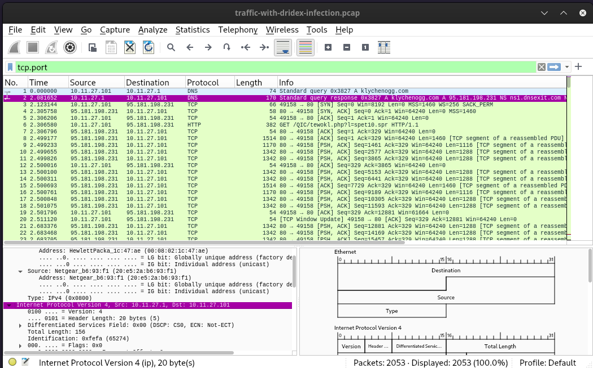
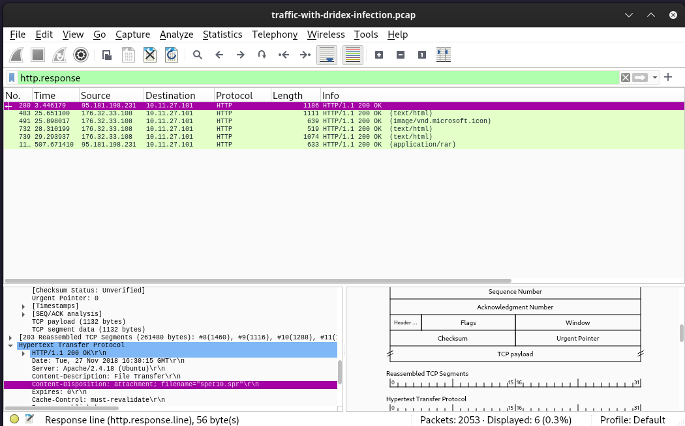
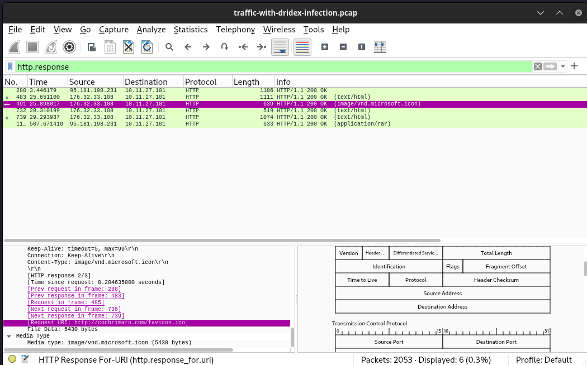
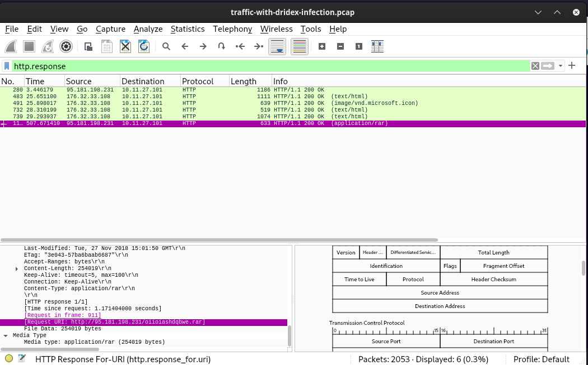
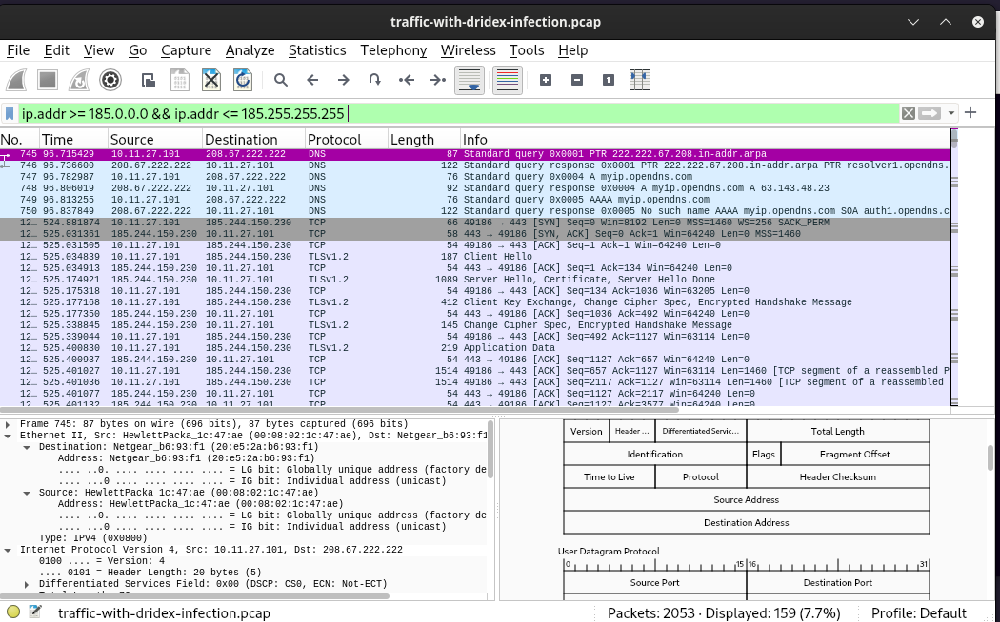

## [Network Analysis – Malware Compromise](https://blueteamlabs.online/home/challenge/network-analysis-malware-compromise-e882f32908)

### Description
` SOC Analyst at Umbrella Corporation is going through SIEM alerts and sees the alert for connections to a known malicious domain. The traffic is coming from Sara’s computer, an Accountant who receives a large volume of emails from customers daily. Looking at the email gateway logs for Sara’s mailbox there is nothing immediately suspicious, with emails coming from customers. Sara is contacted via her phone and she states a customer sent her an invoice that had a document with a macro, she opened the email and the program crashed. The SOC Team retrieved a PCAP for further analysis.`

**Category:** Network Analysis – Malware Compromise
**Tactics:** Social Engineering, Phishing `used by the threat actor.`
**Tools:** Wirehsark and TCP_dump
**Author:** Blue_Team_Labs  

## Question 1
 - What’s the private IP of the infected host?
 
> Approach:
 - Seeing that the first two captures protocol were a DNS showing the host making a request to the internal server (klychenogg.com) `then from the (3rd capture) TCP we notice there was a connection request sent from a private IP address`.
 
 
 **result** 
  
 
 Answer:'10.11.27.101 (host ip address)'

 
## Question 2
 - What’s the malware binary that the macro document is trying to retrieve?
 
> Approach:
 - Knowing that the host has clicked on a malicious mail, looking through pcap files for any 'http response'  from the attacker's IP.
 **result** 
 
Answer:'spet10.spr'

## Question 3
 - From what domain HTTP requests with GET /images/ are coming from? 
 
> Approach:
 - Filtered for http response  from the IPs contacting the host, noticed the a different IP address contacting the host and the http response message, seeing it's an image request.
 
 **result** 
   
 
 Answer: 'cochrimato.com'

## Question 4
 - The SOC Team found Dridex, a follow-up malware from Ursnif infection, to be the culprit. The customer who sent her the macro file is compromised. What’s the full URL ending in .rar where Ursnif retrieves the follow-up malware from? 
 
> Approach:
 - Looking through the http response , noticed request domain
 
 **result** 
   
 
 Answer: http://95.181.198.231/oiioiashdqbwe.rar
 
## Question 5
 - What is the Dridex post-infection traffic IP addresses beginning with 185. ?
 
> Approach:
 - knowing the first octet of the IP to search for, did a filter search for all IPs 185.0.0.0 to 185.255.255.255 the filter resulted to the only IP starting from 185 as the first octect.
 
 **result** 
   
 Answer: '185.244.150.230'

 
