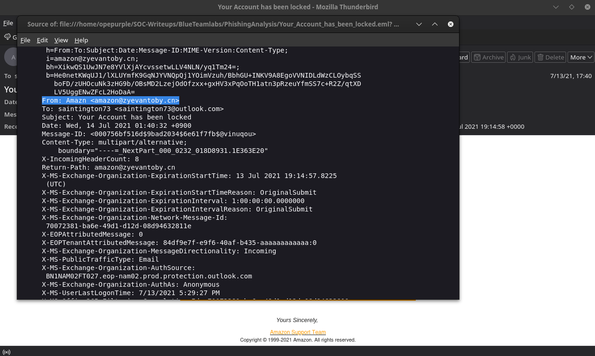
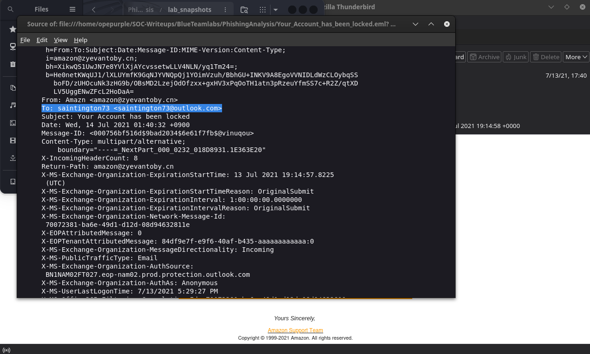
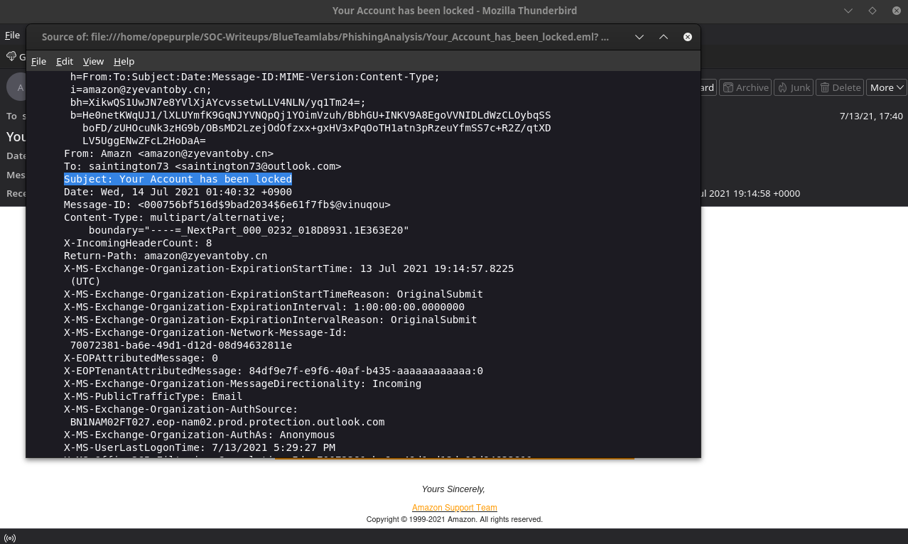
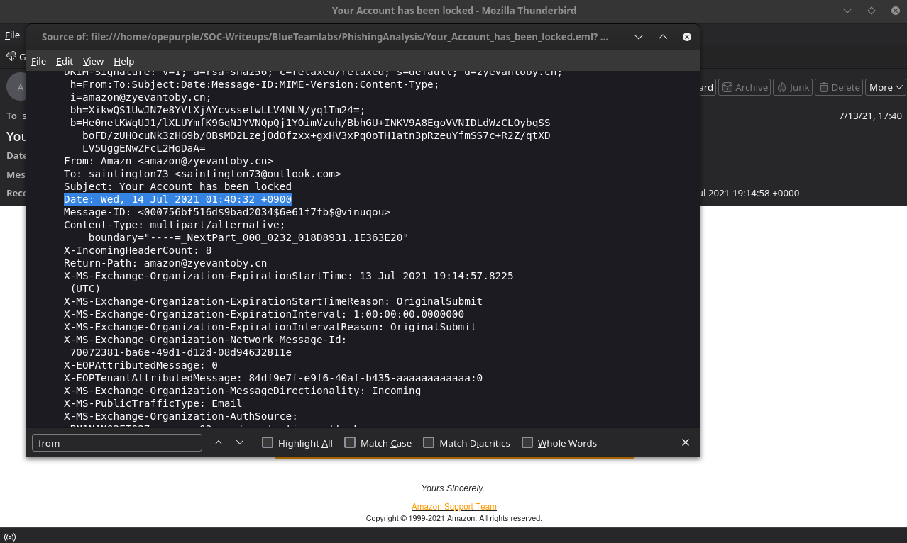
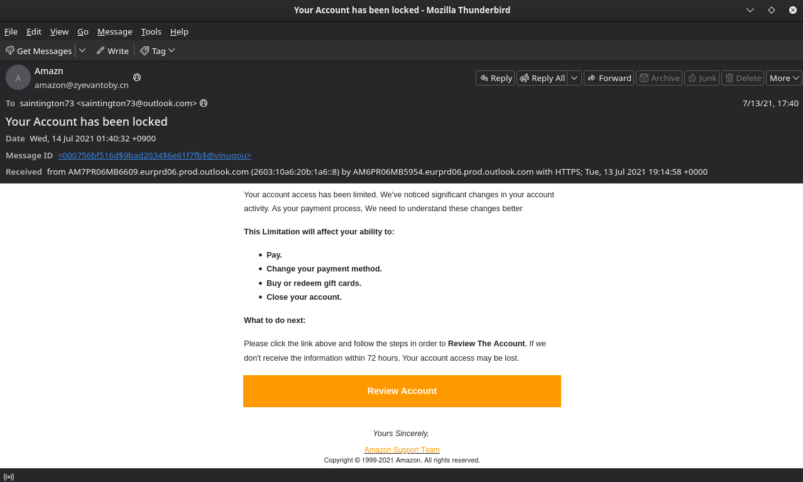
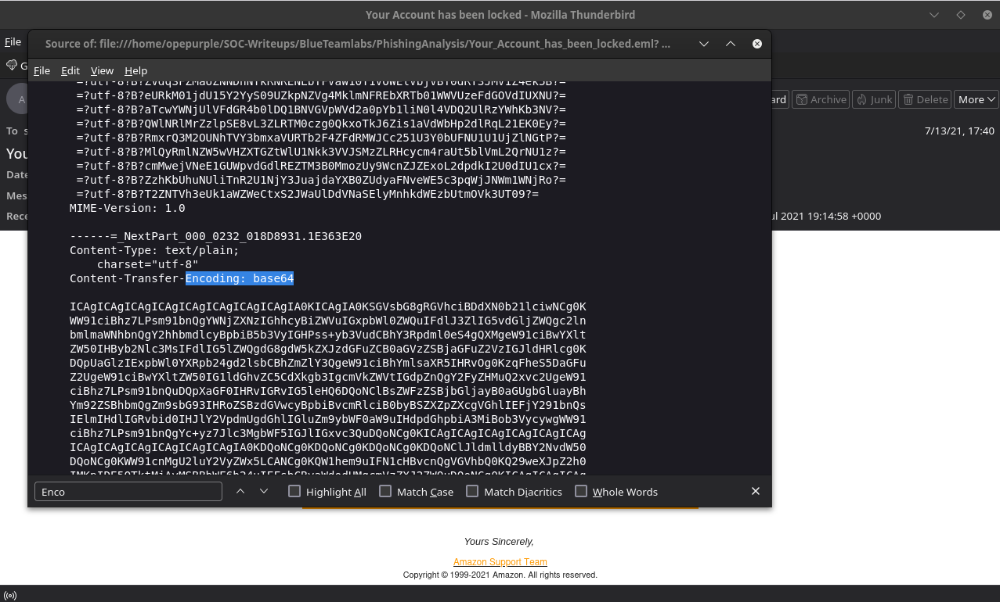
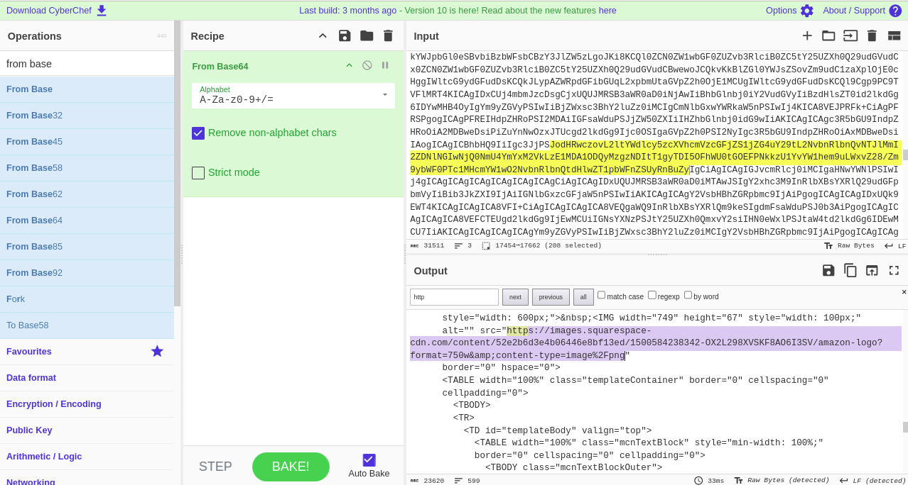
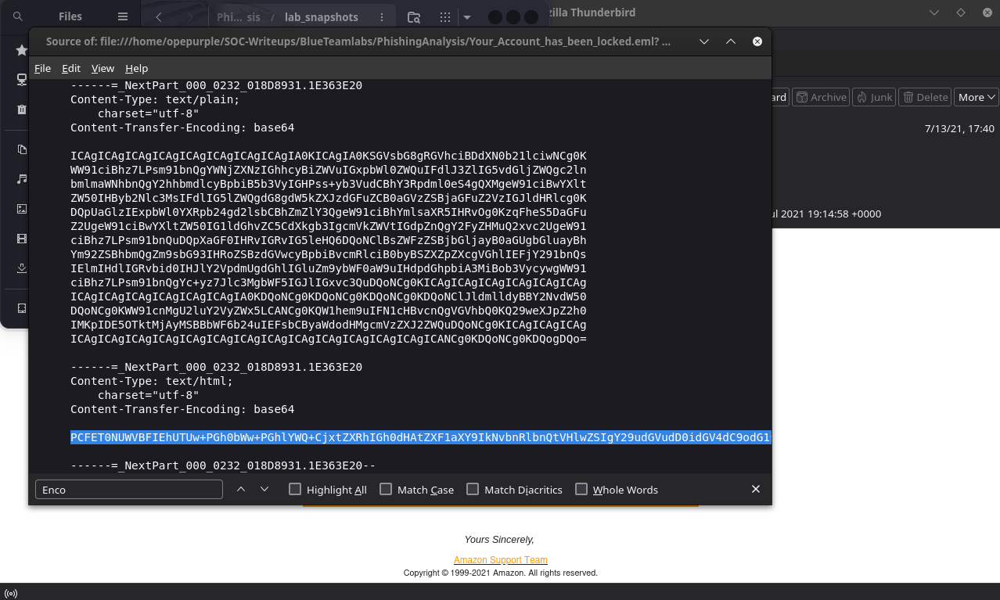

## [Phishing Analysis Lab](https://blueteamlabs.online/home/challenge/phishing-analysis-2-a1091574b8)

### Description
`To test, triage and collect information about a recent phishing campaign.`

**Category:** Phishing Analysis 
**Tactics:** Social Engineering, Phishing `used by the threat actor.`
**Tools:** ThunderBird and CyberChef
**Author:** Blue_Team_Labs  

## Question 1
 - What is the sending email address?
 
> Approach:
 - Always check and confirm senders address and domain address, by checking the senders details in the mail header. `(Using the mail source page....) by using the find function (ctrl+F) to search "FROM"`
 
 **result** 
  
 
 Answer:'Amazn <amazon@zyevantoby.cn>'
 
## Question 2
 - What is the recipient email address? 
 
> Approach:
 - Using the mail source page, we can search for “To” using the Find tool (CTRL+F).
 
 **result** 
 
Answer:'Amazn <amazon@zyevantoby.cn>'

## Question 3
 - What is the subject line of the email?
 
> Approach:
 - Using the mail source page, we can search for “Subject” using the Find tool (CTRL+F).
 
 **result** 
   
 
 Answer: 'saintington73 <saintington73@outlook.com>'

## Question 4
 - What company is the attacker trying to imitate?
 
> Approach:
 - Based on the “FROM” address we can see the attacker is impersonating `Amazon`.
 
 **result** 
   
 
 Answer: Amazon.
 
## Question 5
 - What is the date and time the email was sent? 
 
> Approach:
 - Searched for "DATE", then identifying the message header box.
 
 **result** 
   
 Answer: 'Wed, 14 Jul 2021 01:40:32 +0900'

## Question 6
 - What is the URL of the main call-to-action button?
 
> Approach:
 - To get the hyperlinked malicious url from the Pishing email we need to right-click it and select “Copy Link Location” carefully. `Kindly note there is a risk involved when using this method because you might open the malicious link accidentally. Alternatively, you can use a text editor`.
 
 **result** 
   
 
 

## Question 7
 - When looking at the main body content in a text editor, what encoding scheme is being used? 
 
> Approach:
 - Searched for "Encoding" field, then identifying the message header box.
 
 **result** 
   
 Answer: Base64

## Question 8
 - What is the URL used to retrieve the company's logo in the email? 
 
> Approach:
 - Copied the encoded(base64) text from the mail source page into CyberChef the searched for http field in the output section.
`We know that the image is the first component of the mail body, that is the first url will be the image`
 
 **result** 
  
   
 
