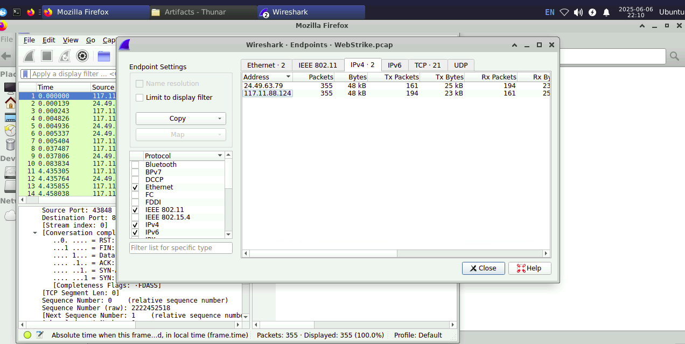
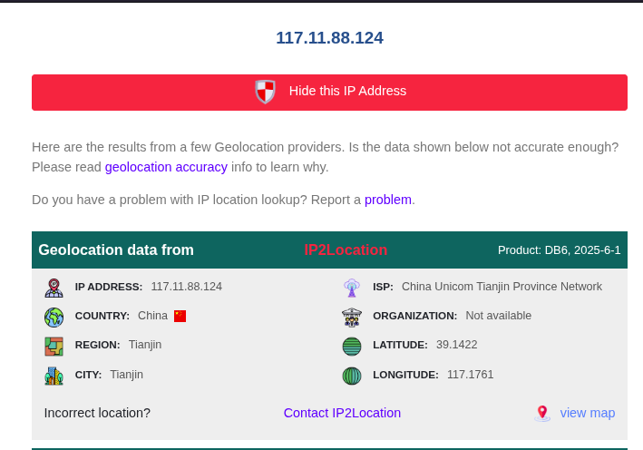
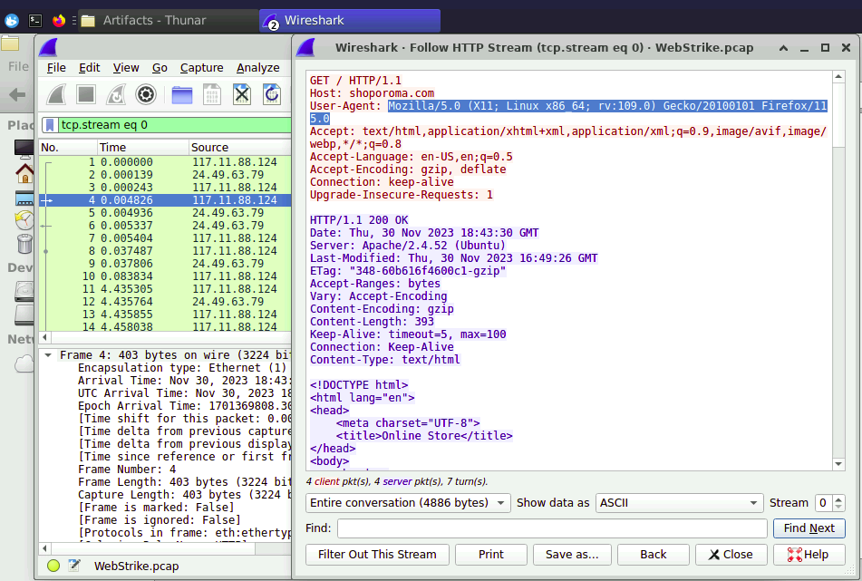
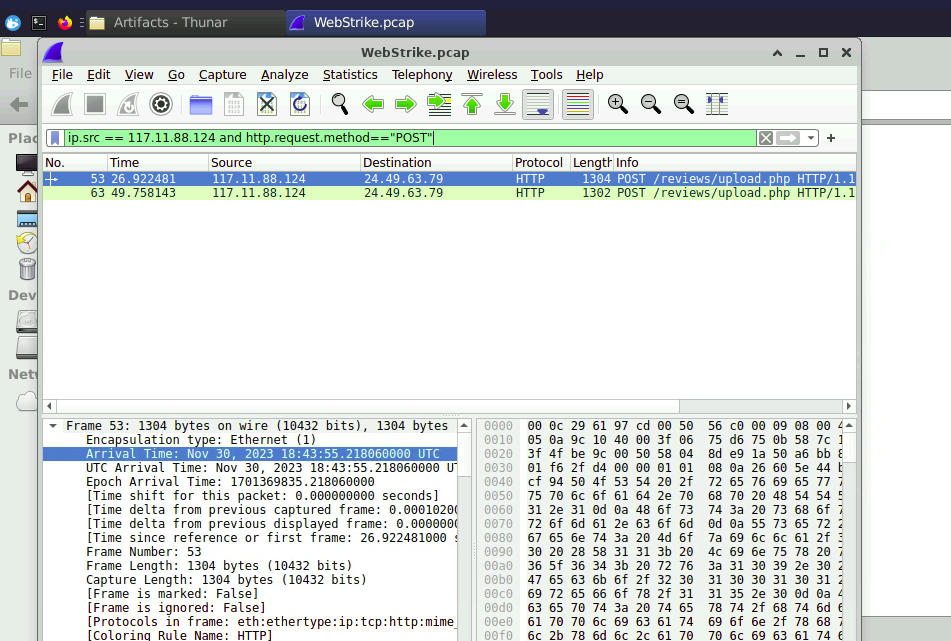
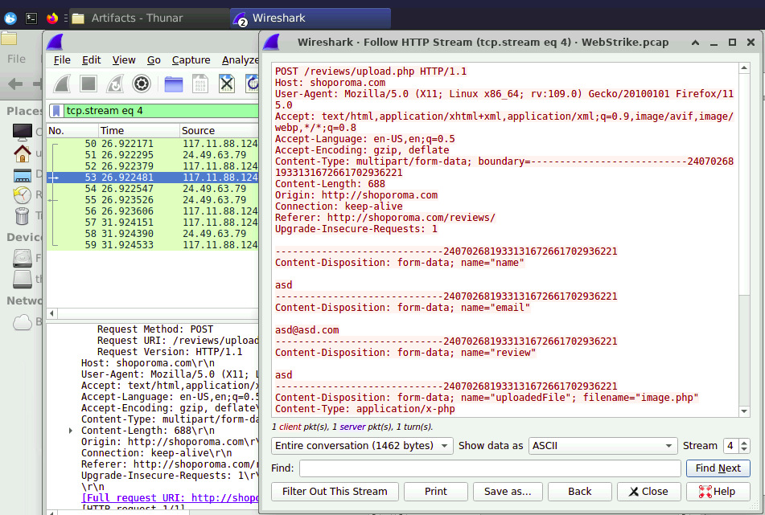
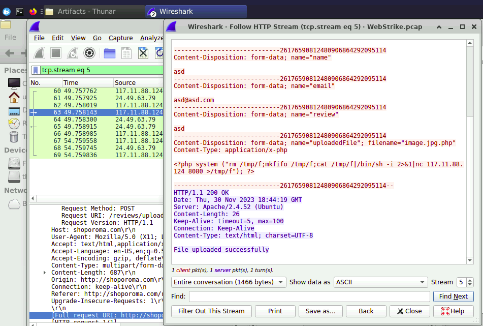
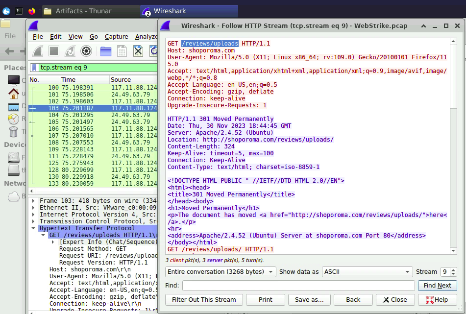
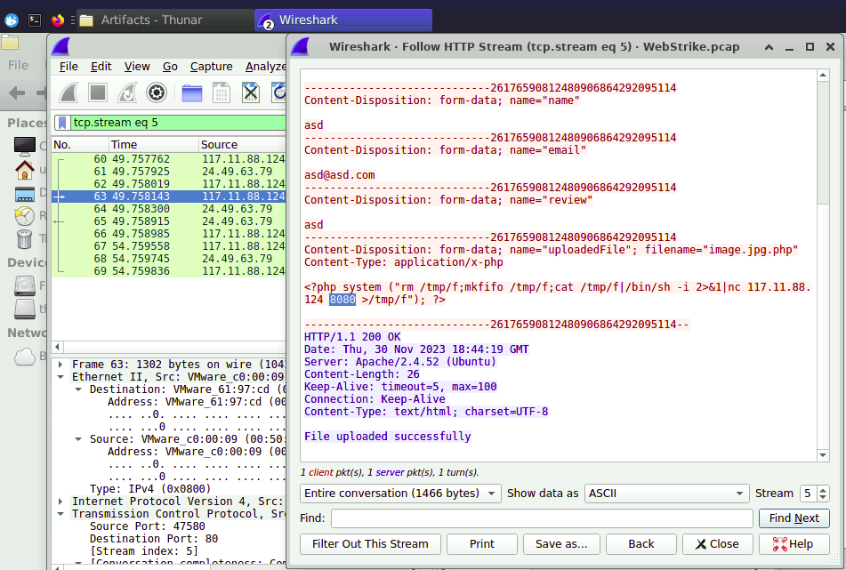
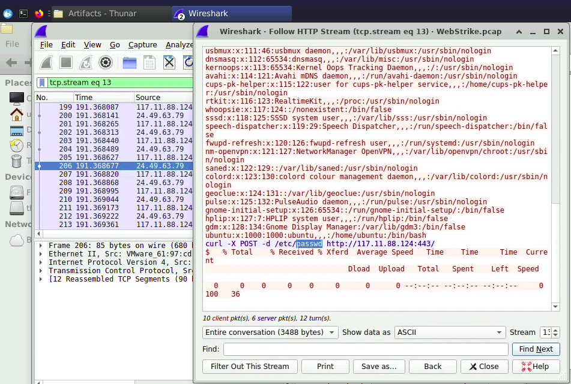

# [PacketDetective Lab - WebStrike Challenge](https://cyberdefenders.org/blueteam-ctf-challenges/webstrike/)

## 📝 Description

`A suspicious file was identified on a company web server, raising alarms within the intranet. The Development team flagged the anomaly, suspecting potential malicious activity. To address the issue, the network team captured critical network traffic and prepared a PCAP file for review.`

**Category:** Network Forensics  
**Tactics:** Execution, Initial Access, Persistence, Exfiltration, Command and Control  
**Tools:** Wireshark  
**Author:** CyberDefender

---

## 🔍 Traffic Analysis Summary (Wireshark)

This section outlines the analytical process and findings derived from inspecting the PCAP file using **Wireshark**. Each question is addressed step-by-step to demonstrate real-world investigative techniques used in network forensics.

---

## ❓ Question 1  
### `From which city did the attack originate?`

Understanding the source location of an attack helps security teams implement **geo-blocking**, inform threat intelligence feeds, and correlate with regional threat actors.

> **Approach:**
- Identified the **source IP address** of the attacker: `117.11.88.124`.
- Verified if any other IPs had persistent communication with the server to confirm if this was a targeted attack.  
  
- Used an **IP Geolocation service** to check the physical origin of the attack.  
  

✅ **Answer:** `Tianjin`

---

## ❓ Question 2  
### `What's the attacker's Full User-Agent?`

Understanding the User-Agent string helps build effective filtering rules or alerting logic in WAFs and SIEMs.

> **Approach:**
- Reviewed all HTTP POST requests originating from the attacker's IP.
- Located the HTTP header that contains the **User-Agent** string sent during the exploit attempt.  
  

✅ **Answer:**  
`Mozilla/5.0 (X11; Linux x86_64; rv:109.0) Gecko/20100101 Firefox/115.0`

---

## ❓ Question 3  
### `What is the name of the malicious web shell that was successfully uploaded?`

Identifying the uploaded web shell is critical to understanding the nature of the attack and how it bypassed security controls.

> **Approach:**
- Filtered all **HTTP POST requests** from IP `117.11.88.124` to inspect file upload attempts.  
  
- The first attempt to upload a `.php` file was **unsuccessful**, likely due to server-side restrictions rejecting non-image or suspicious files.  
  
- The attacker **bypassed** these restrictions by appending `.jpg` to the PHP file name (e.g., `shell.php.jpg`). This technique tricks file-type validation mechanisms to accept the file as an image.  
  

✅ **Answer:** `image.jpg.php`

---

## ❓ Question 4  
### `Which directory is used by the website to store the uploaded files?`

Knowing where files are uploaded is essential for identifying compromised directories and removing malicious payloads.

> **Approach:**
- Monitored **GET requests** from the attacker’s IP after the successful upload to determine the access path.
- Observed that the attacker accessed the uploaded file directly, revealing its storage location.  
  

✅ **Answer:** `/reviews/uploads/`

---

## ❓ Question 5  
### `Which port, opened on the attacker's machine, was targeted by the malicious web shell for establishing unauthorized outbound communication?`

Understanding reverse shell activity and the target port helps detect and block similar command-and-control attempts in the future.

> **Approach:**
- Reviewed the contents of the uploaded web shell.
- The payload inside the shell used **`netcat`** to establish a reverse shell connection **from the server to the attacker**, aiming to give remote access.
- The command clearly showed a connection to port `8080` on the attacker's IP.  
  

✅ **Answer:** `8080`

---

## ❓ Question 6  
### `Which file was the attacker attempting to exfiltrate?`

Identifying sensitive files targeted for exfiltration helps prioritize data protection and initiate breach response measures.

> **Approach:**
- Analyzed communication between the attacker and server after the reverse shell was triggered.
- Observed suspicious activity resembling file access commands.
- Noted that the attacker attempted to **read or exfiltrate the `passwd` file**, which typically stores hashed user credentials on Unix-like systems.  
  

✅ **Answer:** `passwd`

---

