## [Security Blue Teams](https://elearning.securityblue.team/home/courses/free-courses/introduction-to-network-analysis#content#course-capstone#course-capstone#activity-network-analysis-challenge)

### Description

`Last month, our efforts led to the successful dismantling of a major drug trafficking network operating within the UK through the TOR network. The network's primary marketplace was taken down, significantly disrupting their operations and preventing further illicit substances from reaching our streets. However, critical intelligence suggests that one of the masterminds behind this network evaded capture and continued their illegal activities.`

`They have established a platform to "tell their stories" of criminal exploits, serving as a covert hub for their operations. Your mission is to bring this individual to justice. This will not be easy, but we are confident in your expertise and ability to achieve this mission. Your success is pivotal to dismantling this criminal enterprise and safeguarding the public.`

**Category:** DarkWebOps 
**Tools:** The Onion Router (TOR), VPN.
**Author:** Security Blueteams  

More Details: 
1] Gain Access to the Site.

2] Find evidence that the individual(s) is involved in drug trafficking

3] Find any information about the locations in which these criminals congregate.

4] Site: http://panznjcktrpezyln5frnjxf5gv4xoyi7wvd3ykeu6bejxvbynhfpasqd.onion

## Question 1
What command is used in the Console to generate valid credentials? Provide the credentials, too. (Format: Command, Username, Password) - generateUserCredentials(), `User Details - KF7ybuD1: Alyhfot0V9VIWm6W`

> Approach:
 - Gained access to the website: by going through the web console to generate user credential. Exploiting one of the known leftover vulnerability that the webdevs might have left out.
 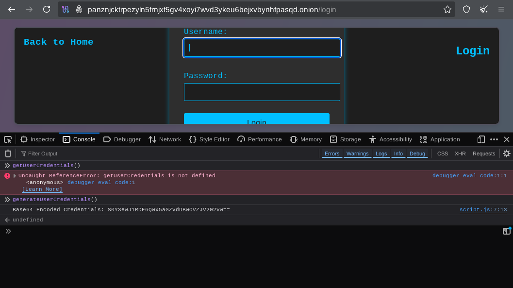 
 
 - Though the details gotten where in Base64 - implored cyberchef for decryption before logging in with the extracted details.
  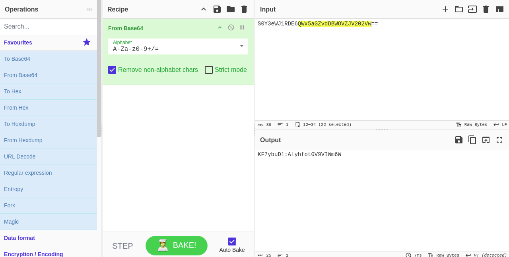 
  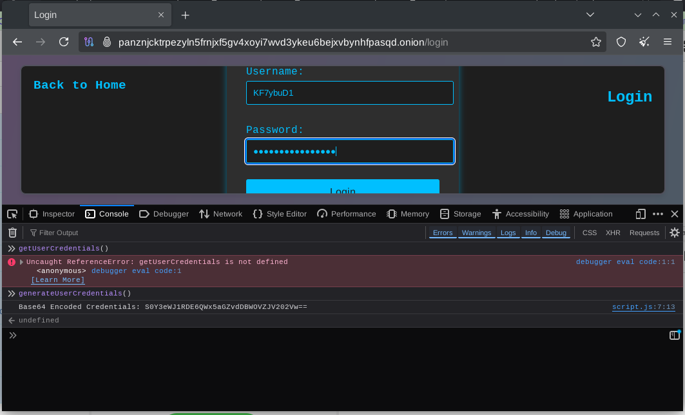 
  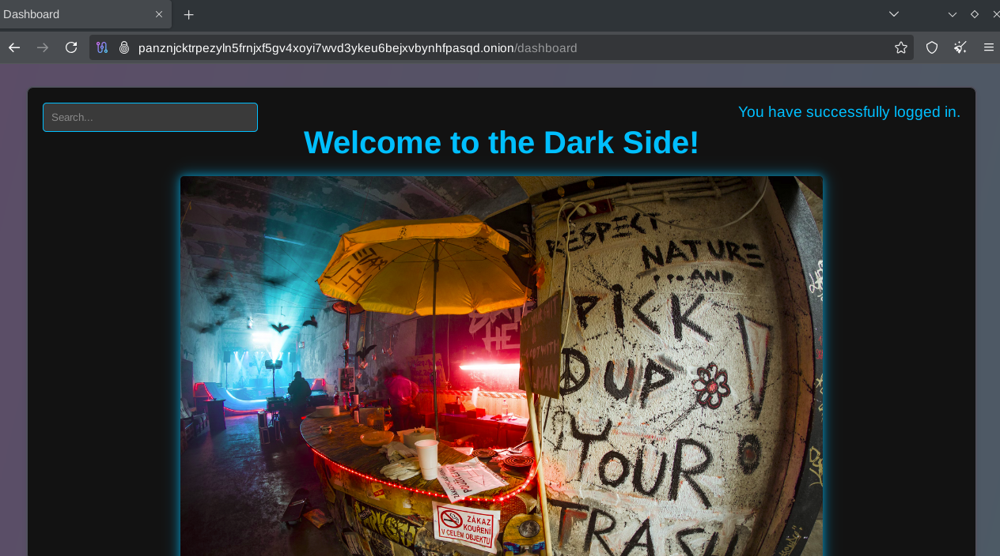 

 
## Question 2
After logging in, what are the titles of the three pinned posts seen on the website in ASCII text? Please place them in respective order. `(Format: Post 1, Post 2, Post 3) - Drugs, Pleasure, Drops.`

> Approach:

- The contents of the three pinned posts where rendered in HEX values, well..here comes cyberchef to the rescue again for the conversion to plain text.
 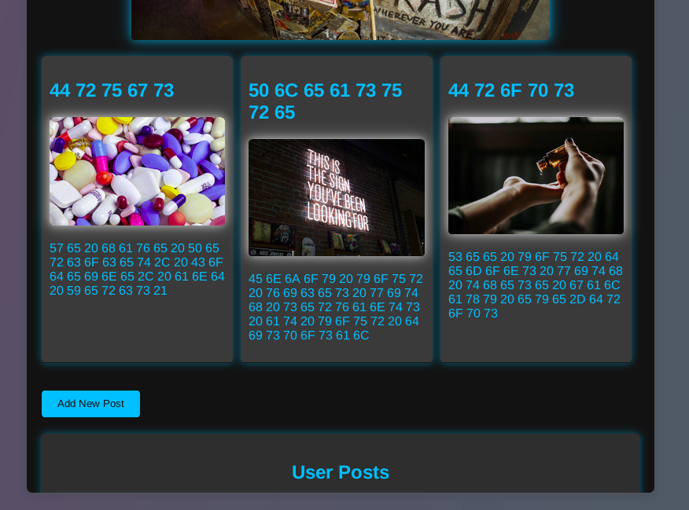 
  
  
 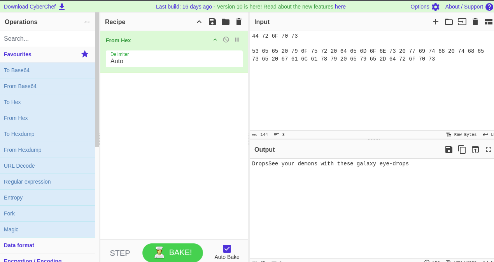 

 
## Question 3
Look at the Messages board. They are mentioning another illegal site. Provide its name. (Format: Hacker Group Name) - Midnite

> Approach:
- Only two of the texts in the message board are hyperlinks, which the first link led to the Hacker Group website.
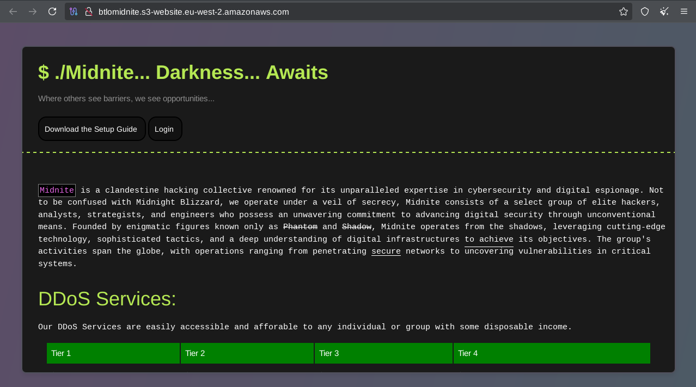 

## Question 4
A transaction log is mistakenly visible under the “Recent Transactions” section. Provide the customer’s full name, email address, and the purpose of the transaction. (Format: Full Name, Email, Xxxxxxx and Xxxxx) - Frank Castle, frankcastle2093@gmail.com,  Hookers and Drugs.

> Approach:
- The second hyperlink was a pdf which contains the detail of a transaction, it shows the PII of the individual and method and information of the payment made.
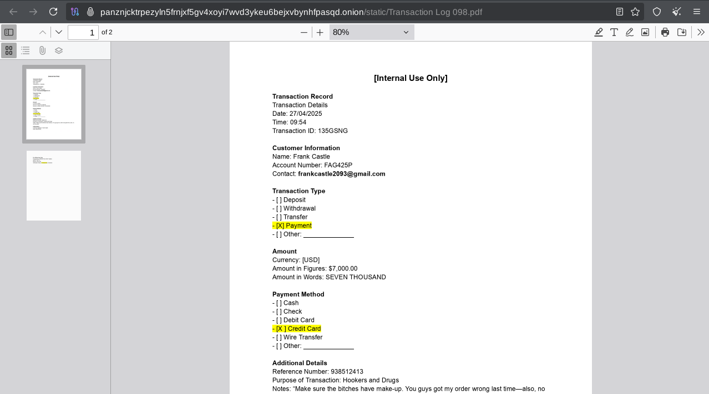 

## Question 5
It looks like the user PJ is hosting an illegal party. What city is this taking place and when? We could catch him there and shut down this entire operation. (Format: City, Month DD, YYYY) - Cardiff, February 14, 2025.

> Approach:
- PJ - gave a heads-up on where the hidden info can be found...so i looked up on the image itself (image size was more that 5mb - enough to know something is clearly hidden in the image), steghide could not finish the job - decided to use an online image decoder which did the job.
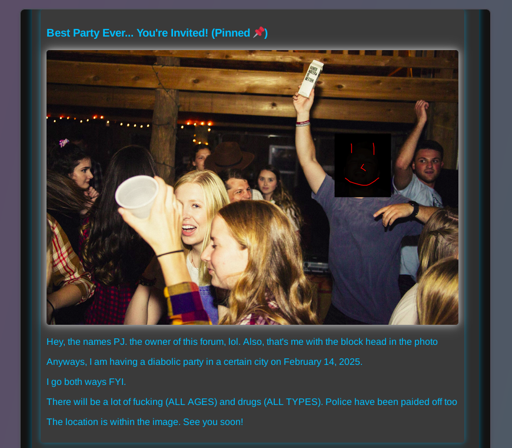 
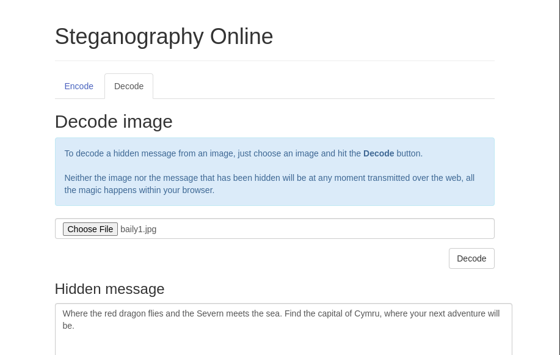 
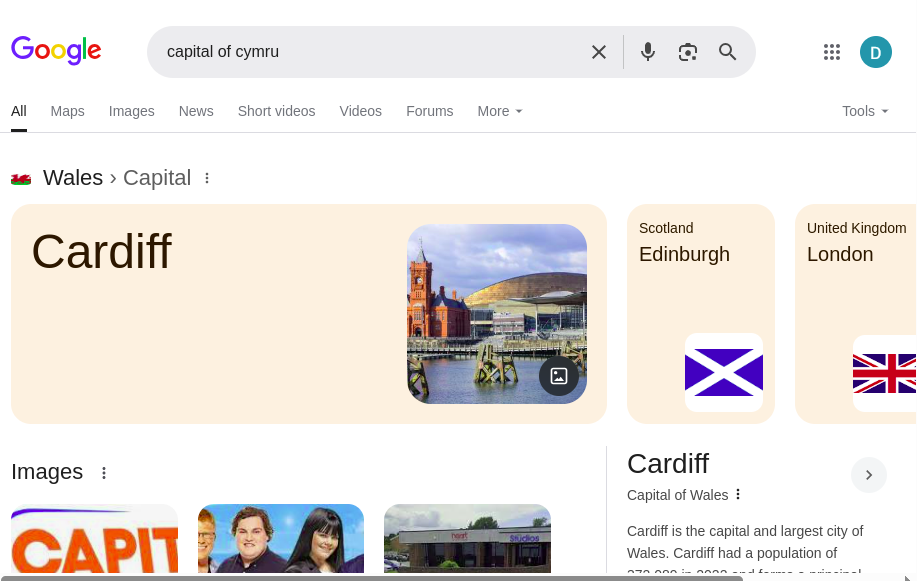 

## Question 6
What is the email of the user selling ‘stolen’ car parts? (Format: Email)
- It is said that the darkweb is a platform for shady deals, well i didn't go too far to find one man that sells stolen cars. If you want one find his details below....
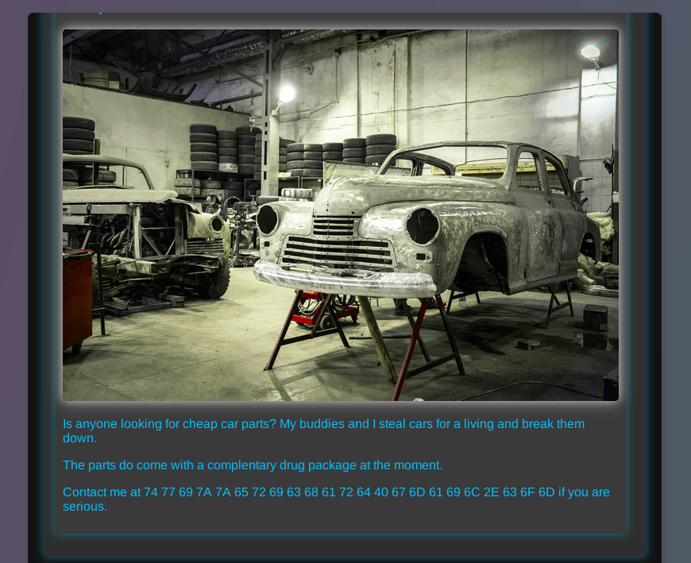 
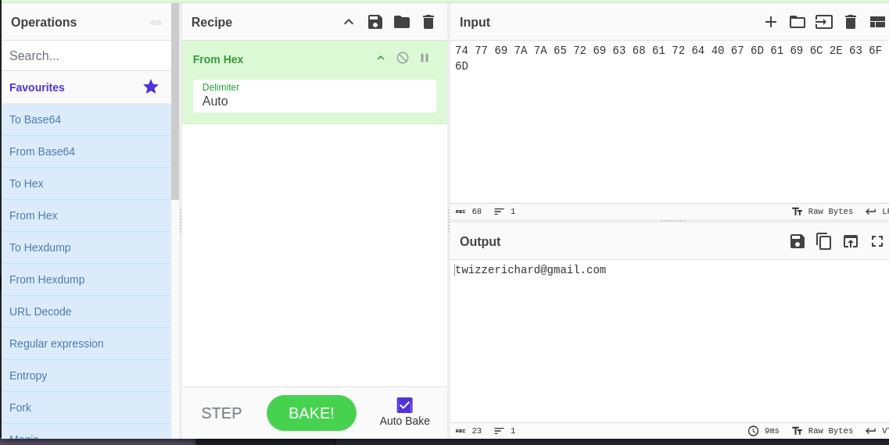 
