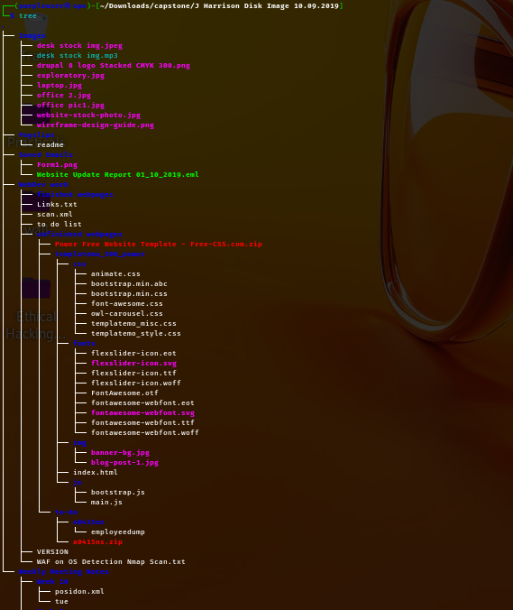
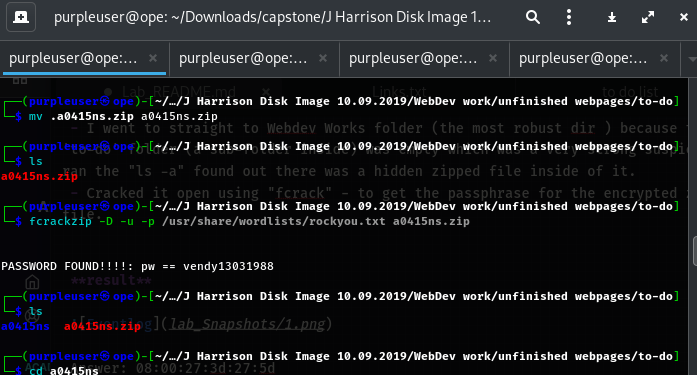
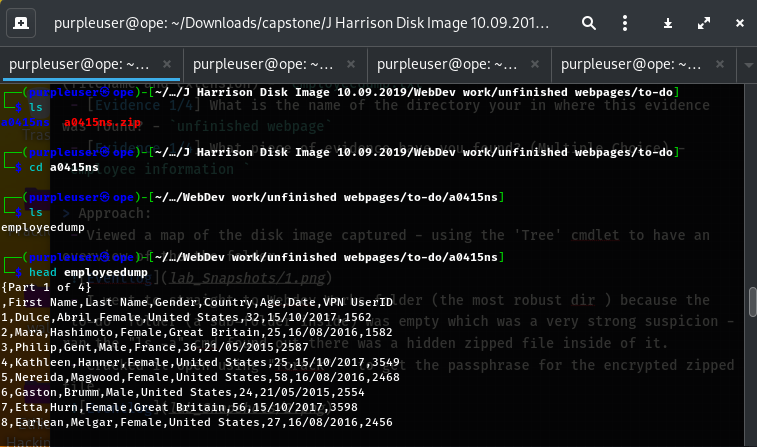
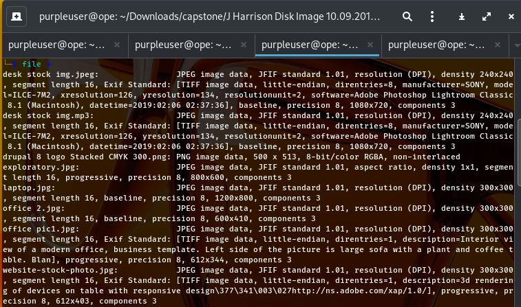
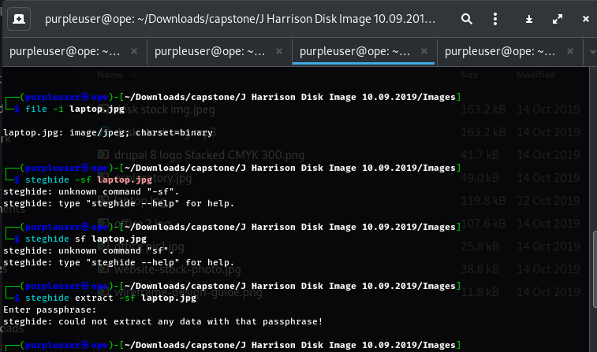
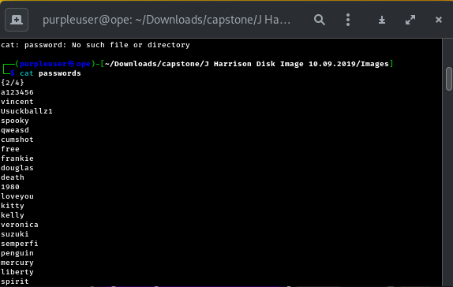
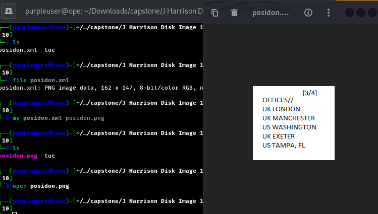
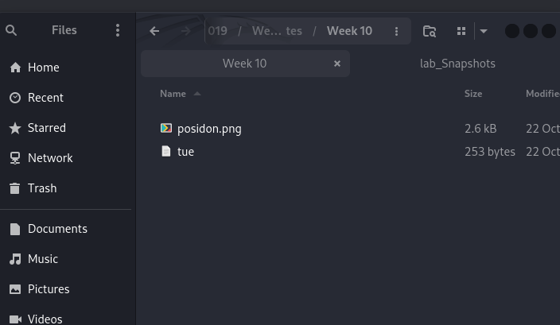
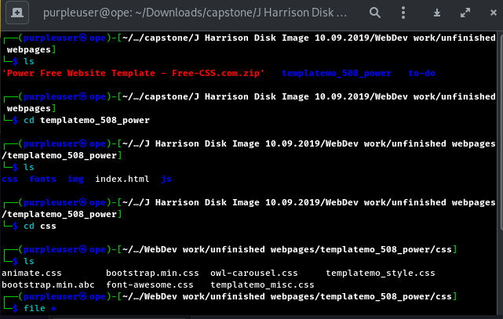
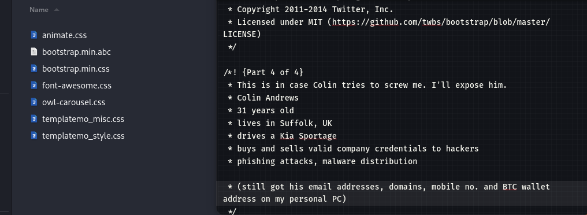

## [Security Blue Teams](https://elearning.securityblue.team/home/courses/free-courses/introduction-to-network-analysis#content#course-capstone#course-capstone#activity-network-analysis-challenge)

### Description

`The SOC has received an anonymous report that a user is potentially exfiltrating data from the company. An image of the user’s hard drive has been taken, and you are responsible for analyzing the contents of a perfect copy to find any evidence of malicious activity.`

**Category:** Digital Forensics 
**Tools:** Unzip, FCrack, Google  
**Author:** Security Blueteams  

<h2> J Harrison Disk Image 10.09.2019 </h2> 
(`Disk image captured from suspect.`)

## Question 1
 - [Evidence 1/4] What is the name of the file where the evidence was found? (filename and extension) - `employeedump.txt`
 - [Evidence 1/4] What is the name of the directory your in where this evidence was found? - `unfinished webpage`
 - [Evidence 1/4] What piece of evidence have you found? (Multiple Choice) - `employee information `
 
> Approach:
 - Viewed a map of the disk image captured - using the 'Tree' cmd to have an overview of the the folder.
  
 - I went to straight to Webdev Works folder (the most robust dir ) because the  'to-do' folder (a sub-folder inside) was empty which was a very strong suspicion - ran the "ls -a" cmd found out there was a hidden zipped file inside of it.
 - Cracked it open using "fcrack" - to get the passphrase for the encrypted zipped file.
  
  

 
## Question 2
- [Evidence 2/4] What is the name of the file where the evidence was found? (filename and extension) - passwords.txt
- [Evidence 2/4] What is the name of the directory your in where this evidence was found? - Images
- [Evidence 2/4] What piece of evidence have you found? (Multiple Choice) - List of employee Passwords

> Approach:

- Went back to the top folder (Images) in the disk image dir, based on the discrepancies noticed at first - noticed the first file extension (mp3) then checked all file info - found out it was an image (jpg file).
  

- (After noticing the file size of some the images) Tried using steghide to find if there is any hidden/masked information - which 3 of the images where encrypted.
 

- (Could not find any lead on how to crack the masked info open) Moved to 'Payslips' dir
- Moved to Saved Emails dir after sifting through Payslips....found an image (checked the image file info -found no tangible information) after a bit of research on other techniques of how one can check hidden information on a file ..... found out "strings" `cmd to  extract and display readable text strings from binary files or .exe files.`
- After the using the string cmd
 
  
 
## Question 3
- [Evidence 3/4] What is the name of the file where the evidence was found? (filename and extension) - Posidon.xml
- [Evidence 3/4] What is the name of the directory your in where this evidence was found? - Week 10
- [Evidence 3/4] What piece of evidence have you found? (Multiple Choice) - List of office Locations

> Approach:

- Looking around the directories, I found an interesting file in the Week 10 directory. The file appears to be an .xml file, but after “catting” it, it turns out it is a PNG file.

- I changed the file extension and see if I can spot anything in the image, found an image which contains the list of office locations.
  
  

## Question 4
- [Evidence 4/4] What is the name of the file where the evidence was found? (filename and extension)
- [Evidence 4/4] What is the name of the directory your in where this evidence was found?
- [Evidence 4/4] What piece of evidence have you found? (Multiple Choice)

> Approach:

- Still looking around the directories, my experience in web technology came in tangible when I noticed this one file to be out of place. It is the `bootstrap.min.abc`, not only knowing CSS is used to style the website and have also worked using `bootstrap in certain web projects`; the files utilize the extensions `.css` .
 

- Actually the thumbnail gave it all out, open the rogue file - found out a particular person named: Colin details has been hacked, which was well hidden in a bootstrap css file.
 

 
