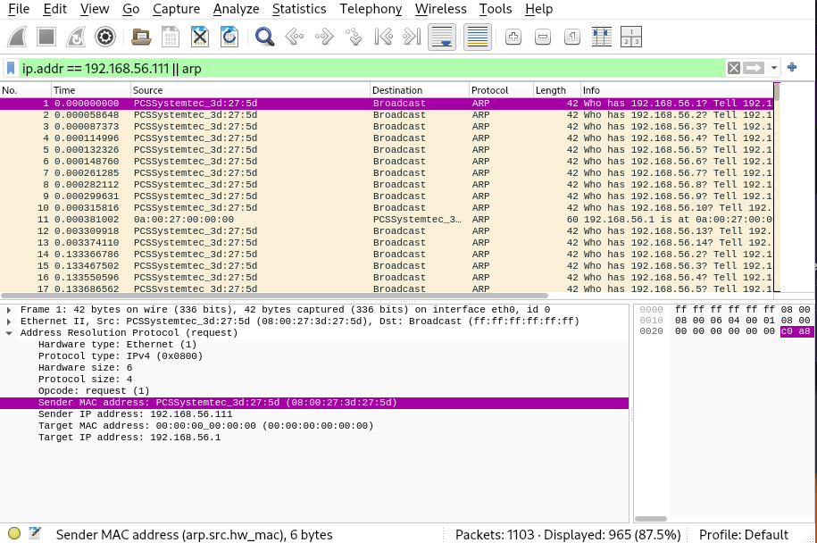
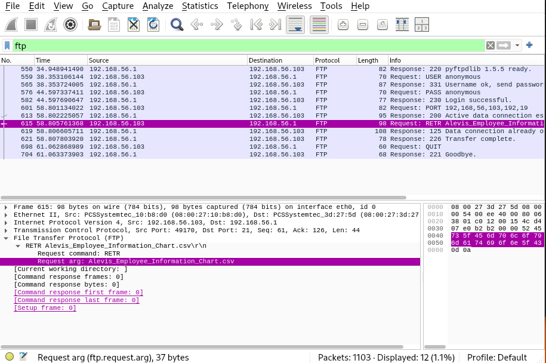
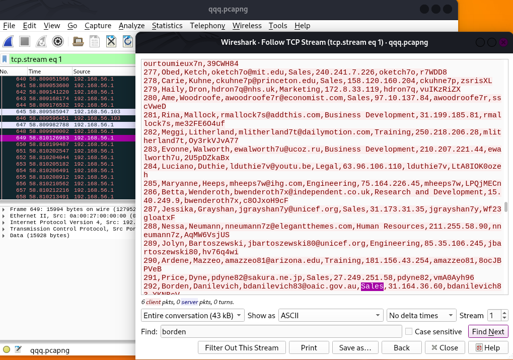
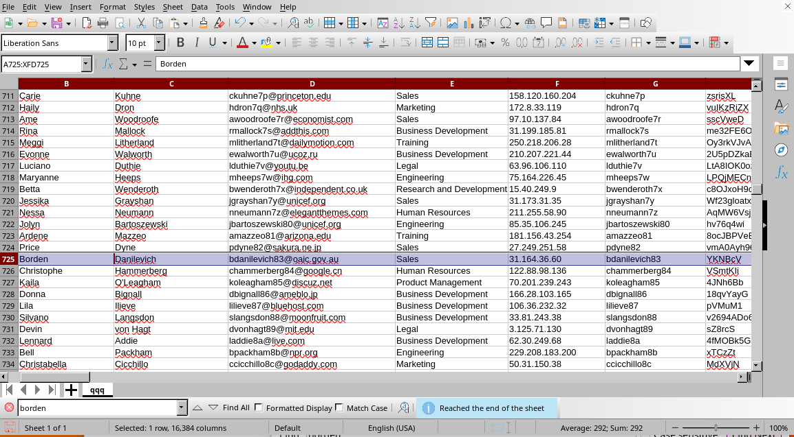
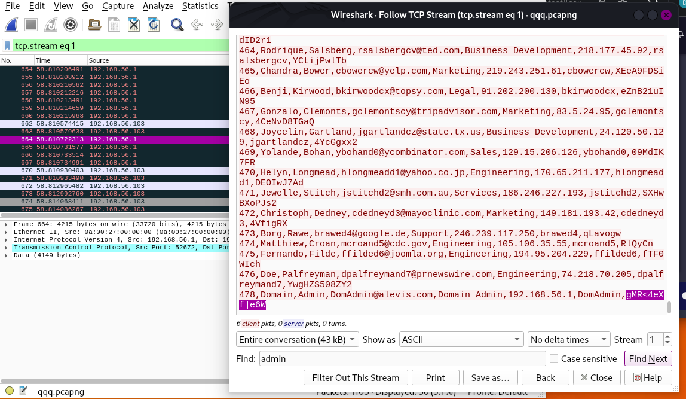
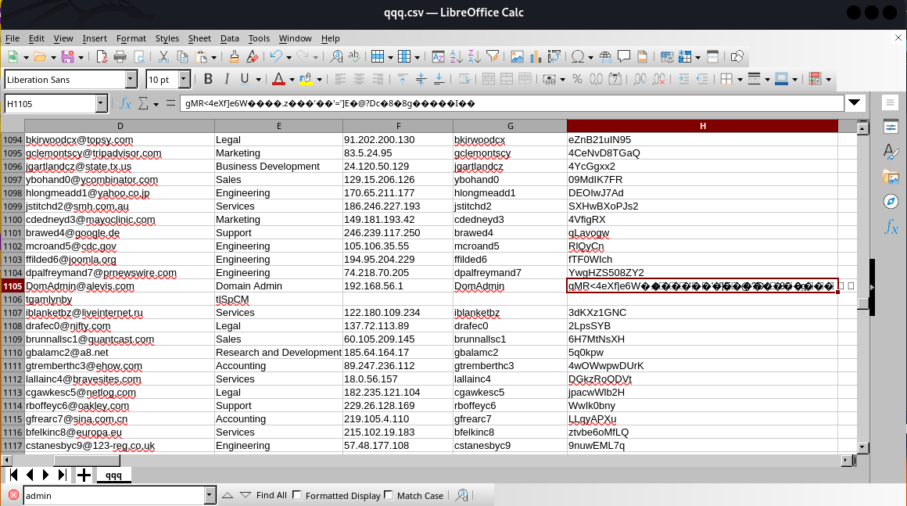

## [Security Blue Teams](https://elearning.securityblue.team/home/courses/free-courses/introduction-to-network-analysis#content#course-capstone#course-capstone#activity-network-analysis-challenge)

### Description

`Alexis is a fictional cybersecurity company with thousands of employees. An attacker has gained unauthorized entry into its premises and has connected their laptop to an unused port on a switch. The attacker now has access to the company’s internal networks. Within the internal network, there is a central server where critical proprietary data is stored. In this capture, the attacker is attempting to collect SSH credentials that they can use to log into the central server.`

**Category:** Network Forensics 
**Tactics:** Execution, Defense Evasion, Command and control `used by the threat actor.`
**Tools:** Wireshark, Google  
**Author:** Security Blueteams  

<h2> Traffic 1 data </h2> 
(`Traffic data generated from wireshark`)

## Question 1
 - What is the MAC address of the attacker?
 
> Approach:
 - Looking at the first packet, the source MAC address is sending an ARP request on the network, 
 - Seeing that the destination IPs is 192.168.56.1 (most occasions ROUTER's IP)
 - Filtered for all ARP packets(Possible MAC Spoofing / Network Reconnaissance) 
 `a common first step when a new device connects to a network,it then tries to find other devices to communicate with.`
 
 **result**
 
  
 
 Answer: 08:00:27:3d:27:5d
 
 
## Question 2
 - What is the file which was downloaded from the central server?
 
> Approach:
 - Knowing from the background story that the attacker wants to access certain credentials which could be downloaded from the central server,
 - Having searched for http responses and yielded no results, then filtered for all FTP packets, followed through the messages on each packet, luckily i found (Request: RETR command) which indicates that a file is being downloaded from the central server (192.168.56.1) to the client (192.168.56.103).
 
 **result** 
   
 Answer: Alevis_Employee_Information_Chart.csv

## Question 3
 - What department does Borden Danilevich work at? (A staff at Alexis)
 
> Approach (2 Methods):
 - 1. Followed the tcpstream of the FTP packet (Request: RETR command) where the file was downloded and set the stream parameter to "1" and then searched for "Borden". 
 **result** 
  
 - 2. Saved the FTP packet wher the file was downloaded and later converted to a .csv file, opend and searched for "Borden".
 **result** 
  
  
 Answer: Sales

## Question 4
 - What is the SSH password of the Domain Administrator?
 
> Approach:
 - Using the same approach as used in "Question 4"
 
 **result** 
   
  
   
  
 Answer: gMR<4eXf]e6W
 
