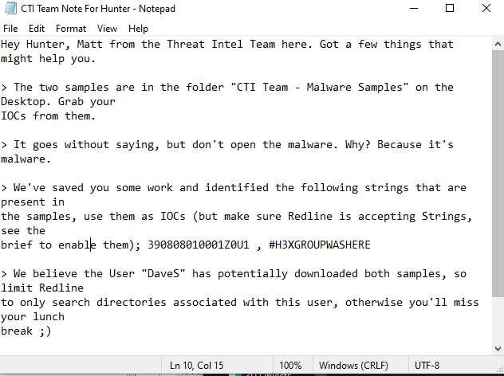
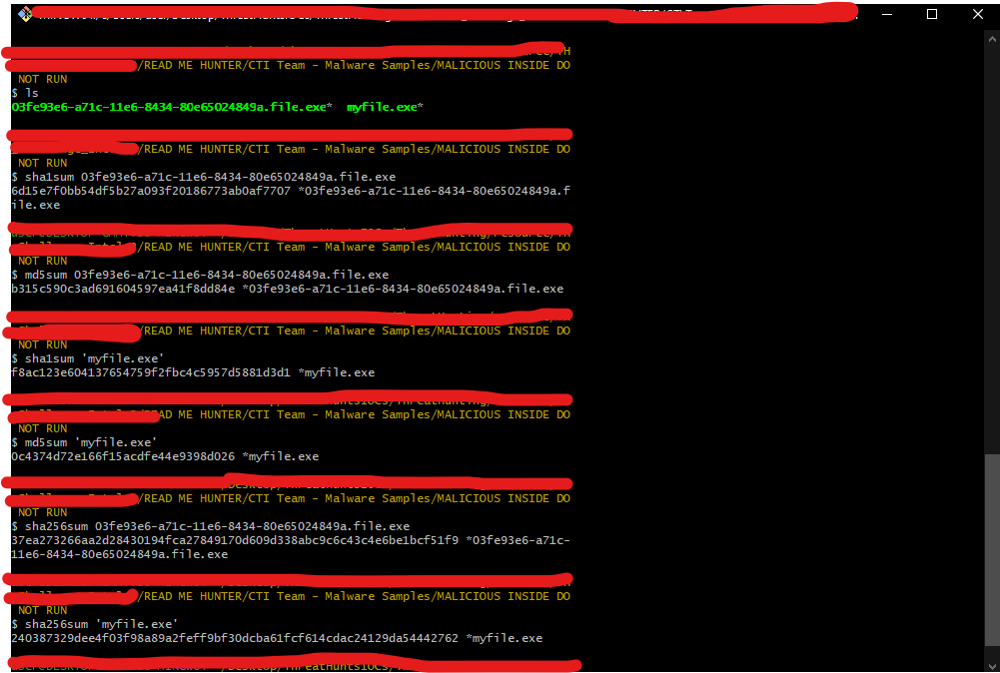
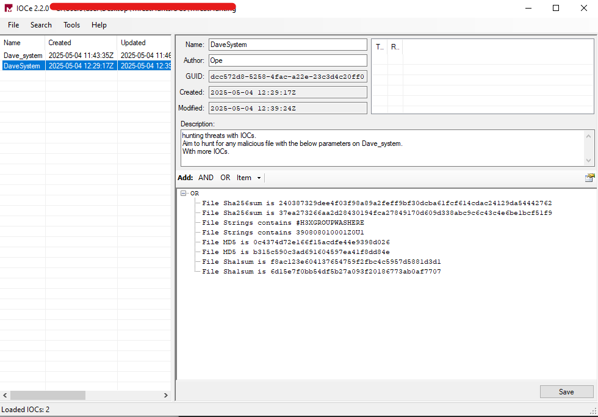
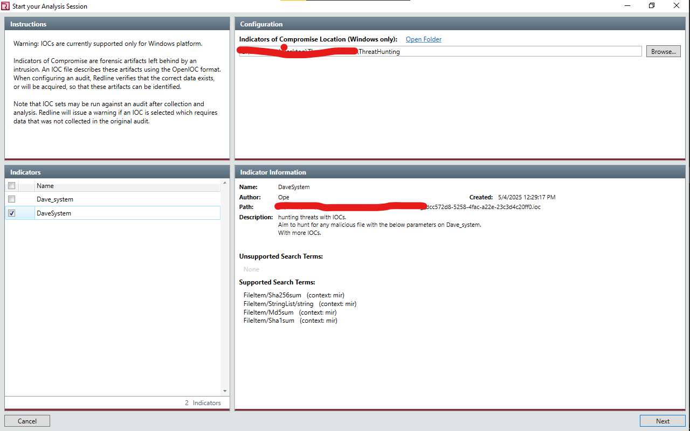
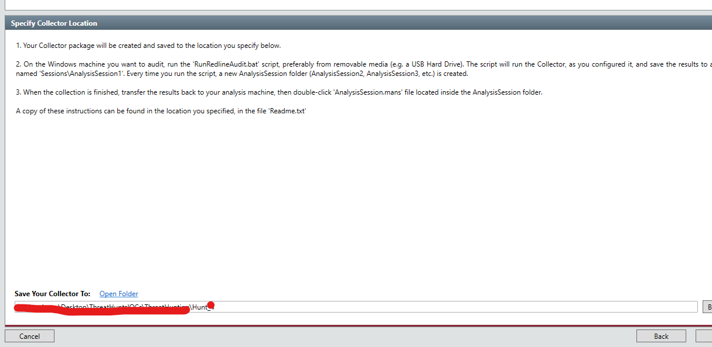
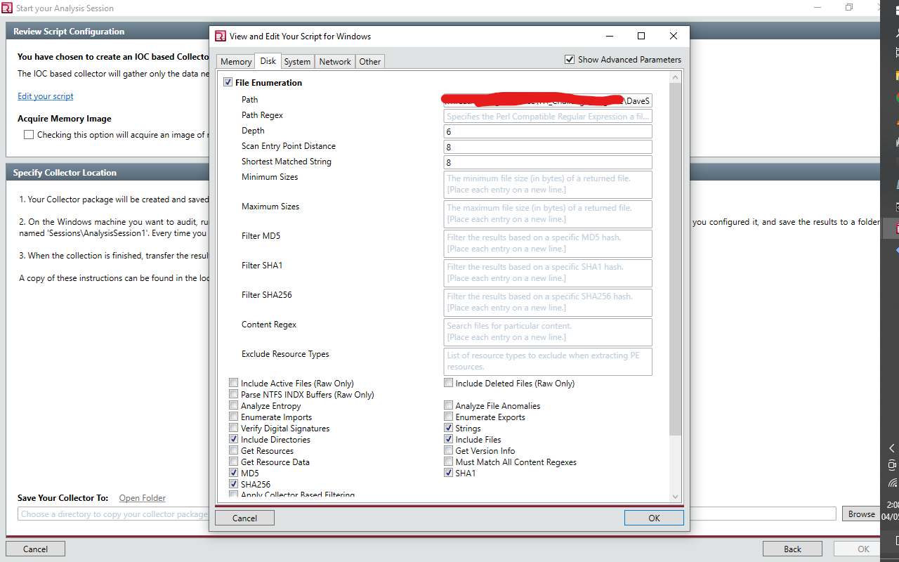
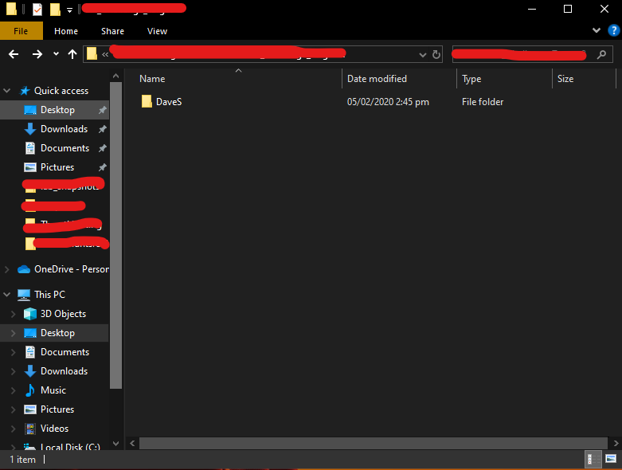
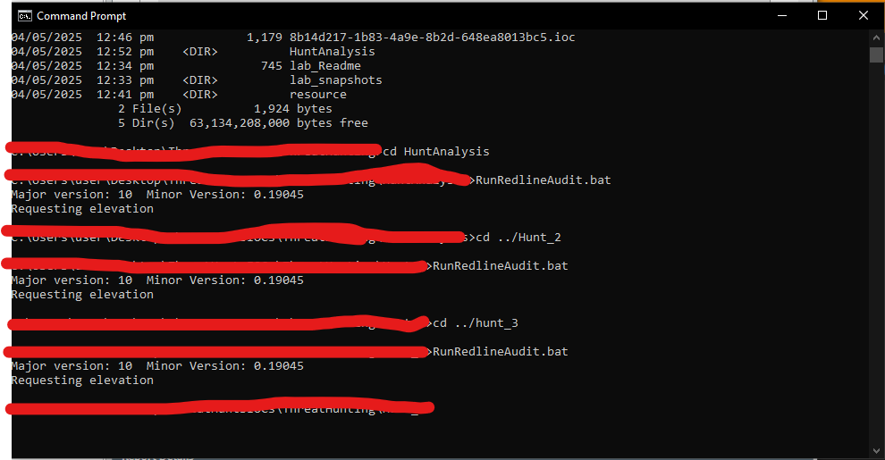
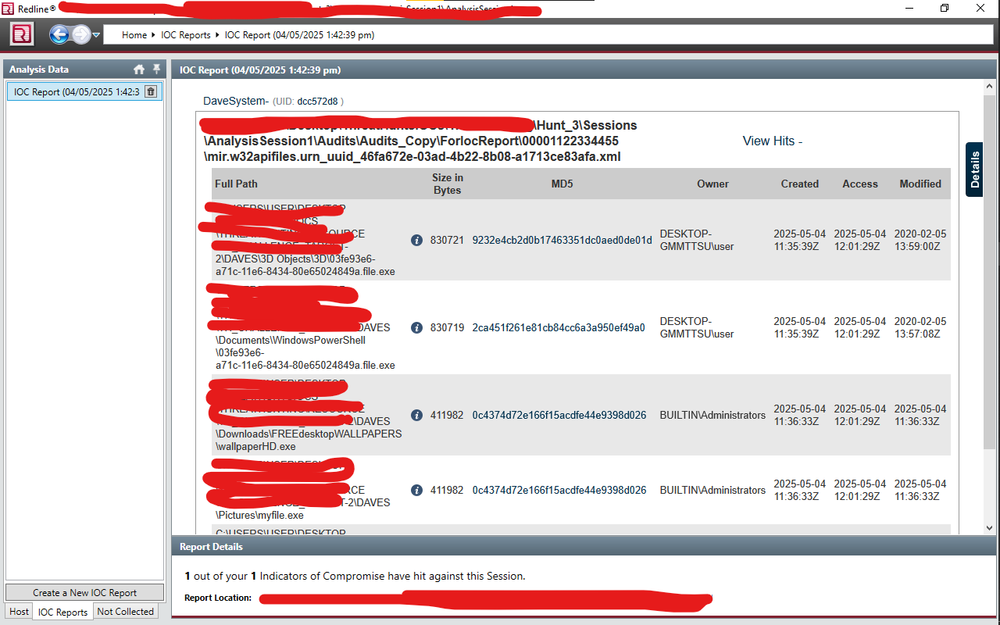

## [Security Blue Teams](https://elearning.securityblue.team/home/courses/free-courses/introduction-to-threat-hunting#content#course-capstone#course-capstone#course-capstone-introduction)

# Threat Hunting Lab Report

## Title:  
**Malware Threat Hunt Using Mandiant IOCe and Redline**

## Category:  
Threat Hunting

## Tools Used:  
- **Mandiant IOC Editor (IOCe)**  
- **Mandiant Redline**

## Author:  
Security Blueteams

---

## Overview

As a Junior Threat Hunter in a security operations team, I was tasked with conducting a focused threat hunt on a disk image taken from a remote endpoint. Due to a concurrent incident involving a data breach and leaked employee credentials, the Threat Intelligence team was unavailable to perform the malware analysis, so I was assigned to identify signs of compromise on the system using two known malware samples.

My responsibility was to extract Indicators of Compromise (IOCs) from the provided malware samples, build detection signatures using Mandiant IOC Editor, and scan the target disk image using Mandiant Redline. The aim was to determine whether the malicious binaries had executed or existed on the system.

---

## Threat Intelligence Brief

The Threat Intelligence team provided key strings observed within the malware samples. These included unique file names, execution patterns, and file paths. This intelligence served as the foundation for building initial IOC rules.

---

## IOC Acquisition and Preparation

In addition to the provided intelligence, I extracted hash values from the suspected malware files:

- **MD5**
- **SHA1**
- **SHA256**

These hash values were included in the IOC signature files to enhance the accuracy and detection capability during the scan.

---

## IOC Creation Using Mandiant IOC Editor

Using the intelligence data and hashes, I created custom IOCs using **Mandiant IOC Editor (IOCe)**. These rules were designed to flag any matches in the memory and file system of the suspect machine image.

---

## Redline Setup and Analysis Configuration

### IOC Import and Configuration:
- Imported the custom IOC files into **Mandiant Redline**.
- Created an empty analysis session as required to initialize the configuration.

  

### Target System Specification:
- Configured Redline to analyze the disk image from the remote system.
- Adjusted scan parameters to align with the custom IOCs for deep inspection.

  

---

## Execution and Results

The analysis was executed using the Redline-generated script, which scanned the provided disk image.

### Scan Results:
- The scan identified **four definitive matches** to the IOCs.
- This confirmed the presence of the suspected malware files on the target system.

  

---

## Conclusion

This exercise demonstrated the process of performing a targeted threat hunt using real-world threat intelligence and forensic tools. By leveraging Mandiant IOCe and Redline, I successfully identified malware presence on a compromised system. This hands-on lab improved my practical skills in:

- Extracting IOCs from malware
- Building custom detection signatures
- Using memory and disk forensics tools
- Conducting investigative scans based on threat intelligence

